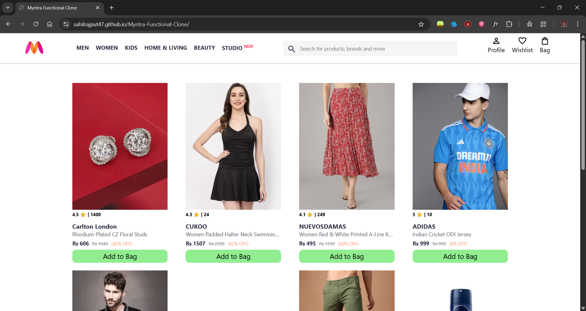

<h1 align="center">🛍️ Myntra Functional Clone</h1>

<p align="center">
  <strong>A modern, fully responsive e-commerce front-end clone of <a href="https://www.myntra.com" target="_blank">Myntra</a> built using the latest HTML, CSS, and JavaScript technologies.</strong>
</p>

<p align="center">
  
  
  
  
  
</p>

---

## 🚀 Live Demo

🔗 **[View Live Project]( https://sahilrajput47.github.io/Myntra-Functional-Clone/)**  
 https://sahilrajput47.github.io/Myntra-Functional-Clone/

---

## ✨ Features

- ✅ Responsive design across all devices
- 🛒 Add to Cart functionality with localStorage
- 🔍 Category-based filtering
- 🧭 Animated navigation & menus
- 🖼️ Stylish banner & product cards
- 🆕 Uses **Heroicons** & **Font Awesome 6**

---

## 📸 Screenshots

| 🏠 Homepage | 
|  | 

---

## 📁 Folder Structure

```bash
myntra-clone/
├── assets/
│   ├── images/
│   └── icons/
├── index.html
├── style.css
├── script.js
└── README.md
